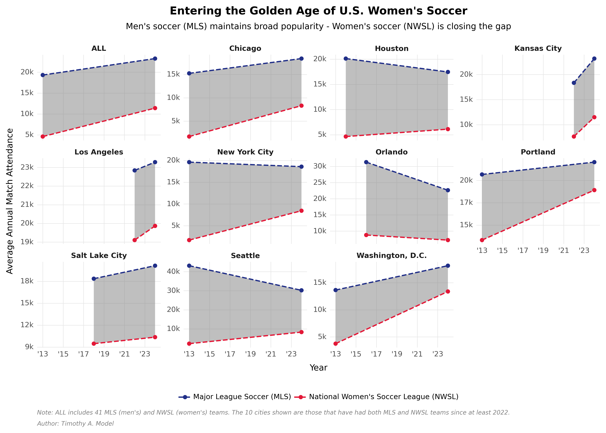

# Soccer Trends :soccer:

With journalists and enthusiasts declaring that "Soccer is taking over America" [(Ikram 2023)](https://fortune.com/2023/09/29/soccer-taking-over-america-apple-win-sports-streaming-wars-mls-deal-aden-ikram/) and with Apple investing in live match streaming in the United States, I wanted to add some color and complexity to the trends we are seeing in soccer's growing popularity. 

This growth is not limited to men's soccer, typically represented by Major League Soccer (MLS). Women's soccer, represented by the National Women's Soccer League (NWSL), is also experiencing a significant surge of investment and interest across the country [(Adgate 2023)](https://www.forbes.com/sites/bradadgate/2023/11/14/the-nwsl-had-a-record-breaking-year-with-more-growth-is-expected/).

My goal was to explore the differential trends in attendance between MLS and NWSL teams. 

The plot I produced highlights three key points:
1. Men's soccer (MLS) is more popular than women's soccer (NWSL).
2. In most cities, men's soccer (MLS) is still growing.
3. Women's soccer (NWSL) match attendance is lower than men's match attendance (NWSL), BUT, in many cities **NWSL attendance is rapidly catching up to MLS attendance**.

# Data Collection

I collected match-level data for every MLS and NSWL team using ESPN, team Wikipedia pages, and [Kaggle](https://www.kaggle.com/datasets/josephvm/major-league-soccer-dataset). In the process of collecting these data, I removed 2020 -- 2021 matches from the dataset due to the consequences of COVID-19 restrictions on match attendance during those two years.

# Analysis

There are multiple ways to visualize this data: LOESS smoothed attendance predictions, simple trend lines, or area charts, among others. These methods could effectively leverage the comprehensive match attendance data collected since 2013 for every home team.

However, I chose faceted slope charts to clearly illustrate how NWSL attendance is catching up to MLS. These charts are faceted by city, including only cities with both MLS and NWSL teams since 2022 or earlier for comparative purposes. Additionally, an "ALL" plot captures the aggregate trends across all MLS and NWSL teams, with each plot starting in the year the newest team began playing, typically an NWSL team.
